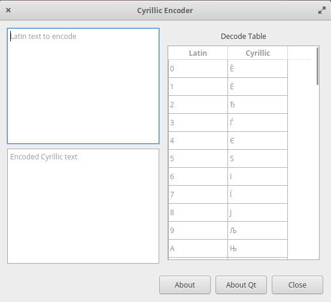

= Cyrillic Encoder
Jordan Williams <jordan@jwillikers.com>
:experimental:
:icons: font
ifdef::env-github[]
:tip-caption: :bulb:
:note-caption: :information_source:
:important-caption: :heavy_exclamation_mark:
:caution-caption: :fire:
:warning-caption: :warning:
endif::[]

A Qt application for encoding alphanumeric characters as arbitrary Cyrillic symbols.

ifdef::env-github[]
++++

  

++++
endif::[]

ifndef::env-github[]

endif::[]

== Getting Started

This sections describes how to setup the build environment required by the project.
This project has been tested with the {cpp} compilers GCC 10 and Clang 12 on https://ubuntu.com/[Ubuntu] 18.04.

. Install the necessary package to simplify adding PPA's to the system.
+
[source,sh]
----
➜ sudo apt -y install software-properties-common
----

. Add Ubuntu's toolchain PPA to get access to newer versions of GCC.
+
[source,sh]
----
➜ sudo add-apt-repository -uy ppa:ubuntu-toolchain-r/test
----

. Install the necessary system packages.
+
[source,sh]
----
➜ sudo apt -y install ccache gcc-10 g++-10 git ninja-build qt5-default python3 python3-pip
----

. Install Python tools.
+
--
[source,sh]
----
➜ python3 -m pip install --user clang-format cmakelang conan
----

[NOTE]
====
`~/.local/bin` will need to be on your `PATH`.
====
--

. Install a newer version of CMake.
.. Download the latest version.
+
[source,sh]
----
➜ wget -LP ~/Downloads/ https://github.com/Kitware/CMake/releases/download/v3.19.5/cmake-3.19.5-Linux-x86_64.sh
----

.. Make the installer executable.
+
[source,sh]
----
➜ chmod +x ~/Downloads/cmake-*.sh
----

.. Change to the `/usr/local` directory.
+
[source,sh]
----
➜ cd /usr/local
----

.. Install CMake in `/usr/local`.
+
[source,sh]
----
➜ sudo ~/Downloads/cmake-*.sh
----

.. Press kbd:[q] to skip reading the license.

.. Enter `y` and press enter to accept the license.

.. Enter `n` and press enter to install to the subdirectories in `/usr/local`.

.. Remove the installer.
+
[source,sh]
----
➜ rm ~/Downloads/cmake-*.sh
----

=== Clang 12

LLVM provides Clang 12 for Ubuntu 18.04.
To install Clang 12 and related tooling, follow these steps.

. Add LLVM's repository for Clang 12 to your system.
+
[source,sh]
----
➜ echo "deb http://apt.llvm.org/bionic/ llvm-toolchain-bionic-12 main" \
  | sudo tee /etc/apt/sources.list.d/llvm.list
----

. Trust LLVM's signing key.
+
[source,sh]
----
➜ wget -qO - https://apt.llvm.org/llvm-snapshot.gpg.key  \
  | sudo tee /etc/apt/trusted.gpg.d/llvm.key.asc > /dev/null
----

. Update your system's sources.
+
[source,sh]
----
➜ sudo apt update
----

. Install Clang and friends.
+
[source,sh]
----
➜ sudo apt -y install clang-12 clang-format-12 clang-tidy-12 lldb-12 lld-12
----

== Build

{cpp} dependencies are managed with Conan.
When using a single configuration generator with CMake, set the appropriate build type when configuring the build.
Likely, this build type will be either _Debug_ or _Release_, both of which are enumerated below.
These examples also enable several helpful options to improve performance of the build and the resulting binaries.
These examples assume you are in the top-level directory of the project and using a build directory named `build`.

Before running CMake, install the necessary dependencies with Conan, using the necessary compiler profile.

GCC::
+
[source,sh]
----
➜ conan install . --install-folder build --build=missing --profile=profiles/gcc-10
----

Clang::
+
[source,sh]
----
➜ conan install . --install-folder build --build=missing --profile=profiles/clang-12
----

Release::
+
--
Configure a release build in the aptly named _build_ directory like so.

GCC::
+
[source,sh]
----
➜ cmake \
  -GNinja \
  -DCMAKE_C_COMPILER=/usr/bin/gcc-10 \
  -DCMAKE_CXX_COMPILER=/usr/bin/g++-10 \
  -DCMAKE_BUILD_TYPE=Release \
  -DCMAKE_UNITY_BUILD=yes \
  -DCMAKE_EXE_LINKER_FLAGS="-fuse-ld=gold" \
  -DCMAKE_MODULE_LINKER_FLAGS="-fuse-ld=gold" \
  -DCMAKE_SHARED_LINKER_FLAGS="-fuse-ld=gold" \
  -DCMAKE_INTERPROCEDURAL_OPTIMIZATION=yes \
  -B build -S .
----

Clang::
+
[source,sh]
----
➜ cmake \
  -GNinja \
  -DCMAKE_C_COMPILER=/usr/bin/clang-12 \
  -DCMAKE_CXX_COMPILER=/usr/bin/clang++-12 \
  -DCMAKE_BUILD_TYPE=Release \
  -DCMAKE_UNITY_BUILD=yes \
  -DCMAKE_EXE_LINKER_FLAGS="-fuse-ld=lld-12" \
  -DCMAKE_MODULE_LINKER_FLAGS="-fuse-ld=lld-12" \
  -DCMAKE_SHARED_LINKER_FLAGS="-fuse-ld=lld-12" \
  -DCMAKE_INTERPROCEDURAL_OPTIMIZATION:BOOL=yes \
  -DCMAKE_CXX_CLANG_TIDY=/usr/bin/clang-tidy-12 \
  -DCLANG_FORMAT_PROGRAM=/usr/bin/clang-format-12 \
  -B build -S .
----
--

Debug::
+
--
To build in debug mode, set the build type appropriately, and enable `-gsplit-dwarf` while you're at it.

GCC::
+
[source,sh]
----
➜ cmake \
  -GNinja \
  -DCMAKE_C_COMPILER=/usr/bin/gcc-10 \
  -DCMAKE_CXX_COMPILER=/usr/bin/g++-10 \
  -DCMAKE_BUILD_TYPE=Debug \
  -DCMAKE_UNITY_BUILD=yes \
  -DCMAKE_EXE_LINKER_FLAGS="-fuse-ld=gold" \
  -DCMAKE_MODULE_LINKER_FLAGS="-fuse-ld=gold" \
  -DCMAKE_SHARED_LINKER_FLAGS="-fuse-ld=gold" \
  -DCMAKE_C_FLAGS_DEBUG="-gsplit-dwarf" \
  -DCMAKE_CXX_FLAGS_DEBUG="-gsplit-dwarf" \
  -DUSE_SANITIZER="Address;Undefined" \
  -B build -S .
----

Clang::
+
[source,sh]
----
➜ cmake \
  -GNinja \
  -DCMAKE_C_COMPILER=/usr/bin/clang-12 \
  -DCMAKE_CXX_COMPILER=/usr/bin/clang++-12 \
  -DCMAKE_BUILD_TYPE=Debug \
  -DCMAKE_UNITY_BUILD=yes \
  -DCMAKE_EXE_LINKER_FLAGS="-fuse-ld=lld-12" \
  -DCMAKE_MODULE_LINKER_FLAGS="-fuse-ld=lld-12" \
  -DCMAKE_SHARED_LINKER_FLAGS="-fuse-ld=lld-12" \
  -DCMAKE_C_FLAGS_DEBUG="-gsplit-dwarf" \
  -DCMAKE_CXX_FLAGS_DEBUG="-gsplit-dwarf" \
  -DCMAKE_CXX_CLANG_TIDY=/usr/bin/clang-tidy-12 \
  -DCLANG_FORMAT_PROGRAM=/usr/bin/clang-format-12 \
  -DUSE_SANITIZER="Address;Undefined" \
  -B build -S .
----
--

Then build.

[source,sh]
----
➜ cmake --build build
----

=== Google Sanitizers

Support for Google Sanitizers is provided by the https://github.com/StableCoder/cmake-scripts[cmake-scripts] project.
Set the `USE_SANITIZER` CMake variable to an appropriate value as documented https://github.com/StableCoder/cmake-scripts#sanitizer-builds-sanitizerscmake[here].

Use the Address and Undefined Behavior sanitizers like so.

[source,sh]
----
➜ cmake -DUSE_SANITIZER=Address;Undefined -B build -S .
----

== Test

Unit tests use https://github.com/boost-ext/ut[[Boost::ext\].μt] and are written in {cpp}.
The unit tests can be run with https://cmake.org/cmake/help/latest/module/CTest.html[CTest].

. Change in to the build directory.
+
[source,sh]
----
➜ cd build
----

. Run the tests by executing the `ctest` executable.
+
[source,sh]
----
➜ ctest
----

== Format

The https://clang.llvm.org/docs/ClangFormat.html[clang-format] and https://cmake-format.readthedocs.io/en/latest/cmake-format.html[cmake-format] tools are used to format the source code files.
The https://github.com/TheLartians/Format.cmake[Format.cmake] module provides build targets to simplify the use of these tools.

Format the source files by building the CMake target `fix-format`.

[source,sh]
----
➜ cmake --build build --target fix-format
----

== Contributing

Contributions in the form of issues, feedback, and even pull requests are welcome.
Make sure to adhere to the project's link:CODE_OF_CONDUCT.adoc[Code of Conduct].

== Open Source Software

This project is built on the hard work of countless open source contributors.
Several of these projects are enumerated below.

* https://asciidoctor.org/[Asciidoctor]
* https://www.boost.org/[Boost {cpp} Libraries]
* https://github.com/boost-ext/ut[[Boost::ext\].μt]
* https://ccache.dev/[ccache]
* https://github.com/TheLartians/Ccache.cmake[Ccache.cmake]
* https://clang.llvm.org/[Clang]
* https://clang.llvm.org/extra/clang-tidy/[Clang-Tidy]
* https://clang.llvm.org/docs/ClangFormat.html[ClangFormat]
* https://cmake.org/[CMake]
* https://cmake-format.readthedocs.io/en/latest/index.html[cmakelang]
* https://github.com/StableCoder/cmake-scripts[CMake Scripts]
* https://gcc.gnu.org/[GCC]
* https://git-scm.com/[Git]
* https://github.com/microsoft/GSL[Microsoft's GSL]
* https://github.com/TheLartians/ModernCppStarter[ModernCppStarter]
* https://ninja-build.org/[Ninja]
* https://www.qt.io/[Qt]
* https://rouge.jneen.net/[Rouge]
* https://www.ruby-lang.org/en/[Ruby]

== Code of Conduct

The project's Code of Conduct is available in the link:CODE_OF_CONDUCT.adoc[Code of Conduct] file.

== License

This repository is licensed under the https://www.gnu.org/licenses/gpl-3.0.html[GPLv3], available in the link:LICENSE.adoc[license file].

© 2021 Jordan Williams

== Authors

mailto:{email}[{author}]
